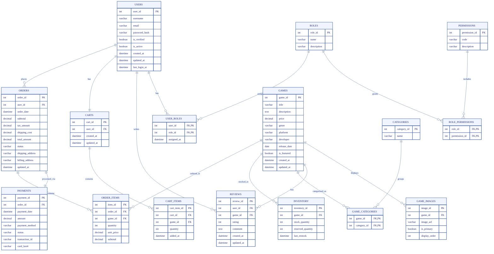

<p align="center">
    <h1 align="center">🎮 Game-Zilla</h1>
</p>

<p align="center">
    <a href="https://reactjs.org/">
        
    </a>
    <a href="https://nodejs.org/">
        
    </a>
    <a href="https://expressjs.com/">
        
    </a>
    <a href="https://www.microsoft.com/sql-server">
        
    </a>
    <a href="https://jwt.io/">
        
    </a>
    <a href="./LICENSE">
        
    </a>
</p>

A full-stack web application for gamers to discover, track, and review video games. Built with React, Node.js, Express, and SQL Server.

> This project was developed as a university semester project for a Database Systems course, with a primary focus on implementing and demonstrating core database concepts. The application utilizes SQL Server features such as indexes, views, and triggers to leverage the full functionality of the database system. Over time, this semester project evolved into a full-stack web application, integrating both frontend and backend technologies for a complete user experience.

## 📚 Table of Contents

- [📋 Features](#-features)
- [🛠️ Tech Stack](#️-tech-stack)
- [🚀 Getting Started](#-getting-started)
    - [Prerequisites](#prerequisites)
    - [Installation](#installation)
    - [Running the Application](#running-the-application)
- [📝 API Documentation](#-api-documentation)
- [📊 Database Schema](#-database-schema)
- [📄 License](#-license)
- [👥 Team](#-team)

## 📋 Features

- **Game Discovery**: Browse and search through an extensive database of games
- **User Authentication**: Secure login and registration system
- **Personal Game Library**: Track your games, mark favorites, and manage your collection
- **Game Reviews**: Read and write reviews for games
- **Responsive Design**: Fully responsive interface that works on desktop and mobile devices

## 🛠️ Tech Stack

- **Frontend**: React.js
- **Backend**: Node.js, Express
- **Database**: SQL Server
- **Authentication**: JWT, bcrypt

## 🚀 Getting Started

### Prerequisites

- Node.js (v14 or higher)
- SQL Server instance
- npm or yarn

### Installation

1. **Clone the repository**
   ```bash
   git clone https://github.com/taqi-m/game-zilla.git
   cd game-zilla
   ```

2. **Set up the backend**
   ```bash
   cd backend
   npm install
   ```

3. **Create a .env file in the backend directory with the following variables**
   ```
   DB_SERVER=your_db_server
   DB_USER=your_db_username
   DB_PASSWORD=your_db_password
   DB_DATABASE=your_db_name
   DB_PORT=1433
   ```

4. **Set up the frontend**
   ```bash
   cd ../frontend
   npm install
   ```

### Running the Application

1. **Start the backend server**
   ```bash
   cd backend
   npm run dev
   ```
   The server will run on http://localhost:5000

2. **Start the frontend development server**
   ```bash
   cd frontend
   npm start
   ```
   The application will open in your browser at http://localhost:3000

## 📝 API Documentation

| Endpoint | Method | Description | Parameters |
|----------|--------|-------------|------------|
| `/api/auth/register` | POST | Register a new user | username, email, password_hash |
| `/api/auth/login` | POST | Login a user | email, password |
| `/api/auth/logout` | POST | Logout a user | None |
| `/api/users` | GET | Get all users | None |
| `/api/users/:id` | GET | Get a specific user | None |
| `/api/users/:id` | PUT | Update a user | username, email, is_active (optional) |
| `/api/users/:id` | DELETE | Delete a user | None |
| `/api/games` | GET | Get all games | sort, genre, platform (all optional) |
| `/api/games/genres` | GET | Get all game genres | None |
| `/api/games/platforms` | GET | Get all game platforms | None |
| `/api/games/:id` | GET | Get a specific game | None |
| `/api/games` | POST | Create a new game | title, description, price, genre, platform, developer, release_date, is_featured |
| `/api/games/:id` | PUT | Update a game | title, description, price, genre, platform, developer, release_date, is_featured |
| `/api/games/:id` | DELETE | Delete a game | None |
| `/api/reviews/game/:gameId` | GET | Get reviews for a game | None |
| `/api/reviews` | POST | Create a review | game_id, rating, comment |
| `/api/reviews/:reviewId` | PUT | Update a review | rating, comment |
| `/api/reviews/:reviewId` | DELETE | Delete a review | None |
| `/api/cart/:userId` | GET | Get user's cart | None |
| `/api/cart/add` | POST | Add item to cart | game_id, quantity, user_id |
| `/api/cart/update` | PUT | Update cart item | cart_item_id, quantity |
| `/api/cart/remove/:cart_item_id` | DELETE | Remove item from cart | None |
| `/api/cart/:userId/clear` | DELETE | Clear user's cart | None |
| `/api/orders` | GET | Get all orders | None |
| `/api/orders/:userId` | GET | Get orders for a user | None |
| `/api/orders` | POST | Place an order | user_id, cart_id, payment_id, shipping_address, billing_address |
| `/api/orders/details/:orderId` | GET | Get order details | None |
| `/api/orders/status/:orderId` | PUT | Update order status | status |
| `/api/orders/payment` | POST | Process payment | user_id, cart_id, amount, payment_method, card_last4 (optional) |
| `/api/categories` | GET | Get all categories | None |
| `/api/categories` | POST | Create a category | name |
| `/api/categories/:id` | PUT | Update a category | name |
| `/api/categories/:id` | DELETE | Delete a category | None |

## 📊 Database Schema

The following Entity-Relationship Diagram (ERD) shows the database structure of Game-Zilla:



## 📄 License

This project is licensed under the MIT License. - see the [LICENSE](LICENSE) file for details.

This means:
- You are free to use, modify, and distribute this software
- You may distribute modified versions under any license of your choice
- You are not required to release derivative works as open source
- The software is provided “as is”, without warranty of any kind
<div align="center">

## 👥 Team

<table>
    <tr>
        <td align="center" valign="middle">
            <br/>
            <a href="https://github.com/taqi-m"><b>Muhammad Taqi</b></a><br/>
            <sub>Lead Developer</sub>
        </td>
        <td align="center" valign="middle">
            <br/>
            <a href="https://github.com/l232550"><b>Tooba Nadeem</b></a><br/>
            <sub>UI/UX Designer</sub>
        </td>
        <td align="center" valign="middle">
            <br/>
            <a href="https://github.com/NayabMaryam"><b>Nayab Maryam</b></a><br/>
            <sub>Backend Engineer</sub>
        </td>
    </tr>
</table>

</div>

